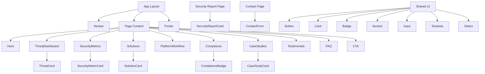

# Component Structure

## Component Diagram

## Explanation

The application follows a three-tier component hierarchy:

1. **Layout** (`Navbar`, `Footer`) — persistent chrome on every page
2. **Sections** — composable marketing blocks used on the home page and reused across routes
3. **Security components** — domain-specific cards and forms that sections and pages import

Shared UI primitives (`Button`, `Card`, `Badge`, form inputs) provide consistent styling and behavior. Data flows from `data/*.ts` into security components and sections — components do not fetch from APIs.

Pages in `app/` are thin orchestrators that import and arrange sections.
