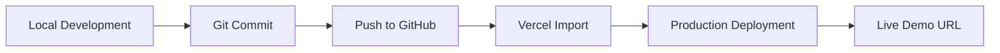

# Deployment

## Deployment Diagram



**Live Demo:** https://cybersecurity-website-umber.vercel.app/

## Deployment Steps

1. **Build locally** — Run `pnpm build` to verify the production build succeeds.
2. **Push to GitHub** — Commit and push to `https://github.com/Valakasneckle/07-cybersecurity-website`.
3. **Import into Vercel** — Connect the GitHub repository in the Vercel dashboard.
4. **Deploy** — Use default Next.js settings (framework preset: Next.js, build command: `next build`, output: default).
5. **Copy production URL** — Confirm deployment at `https://cybersecurity-website-umber.vercel.app/`.
6. **Update README and env** — Ensure `README.md` and `.env.example` reference the live URL.
7. **GitHub About section** — Add website URL and topics to the repository profile.
8. **Portfolio promotion** — Add the live URL to LinkedIn profile and portfolio hub.

## Environment Variables

| Variable | Value |
|----------|-------|
| `NEXT_PUBLIC_SITE_URL` | `https://cybersecurity-website-umber.vercel.app/` |

Set in Vercel project settings under Environment Variables for Production, Preview, and Development.

## Local Development

```bash
pnpm install
cp .env.example .env.local
pnpm dev
```

## Production Build

```bash
pnpm build
pnpm start
```
