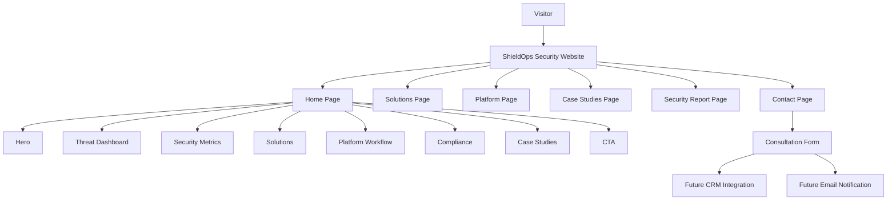

# System Overview

## Architecture Diagram

## Explanation

Visitors arrive at the ShieldOps Security marketing website and navigate across six primary routes. The home page serves as the main conversion funnel, combining product demonstration (threat dashboard), trust building (metrics, compliance, case studies), and repeated calls to action.

The contact page captures consultation requests through a structured form. In a production deployment, this form would connect to a CRM and email notification system — currently UI-only for portfolio demonstration.

All pages share a common layout (navbar + footer) and pull content from static TypeScript data files, making the site fast to deploy and easy to maintain.
