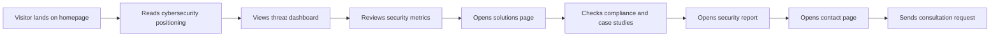

# User Flow

## Conversion Flow Diagram

## Explanation

The user flow is designed for **trust-building before conversion**:

1. **Positioning** — The hero establishes ShieldOps as an enterprise-grade cloud security partner.
2. **Proof of capability** — The threat dashboard and metrics demonstrate technical depth without requiring a product login.
3. **Service exploration** — Solutions and platform pages let buyers map offerings to their needs.
4. **Trust validation** — Compliance badges and case studies address enterprise procurement concerns.
5. **Risk assessment** — The security report page shows analytical depth and executive-ready reporting.
6. **Conversion** — The contact form captures qualified leads with company size, project type, and security concern fields.

CTAs ("Request Security Audit") appear at the navbar, mid-page bands, and footer to capture visitors at different readiness levels.
